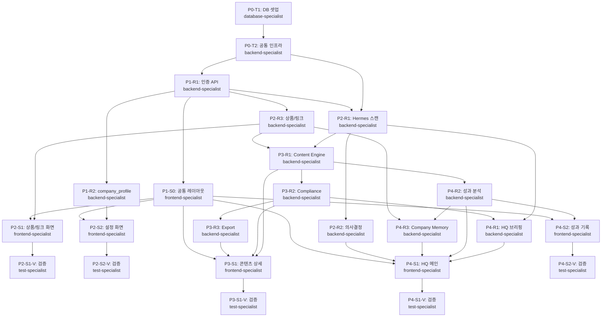

# 06-tasks.md: Paperclip Company OS — 구현 로드맵

> **프로젝트**: Paperclip Company OS  
> **기준일**: 2026-07-02  
> **총 Phase**: 5개 (P0~P4)  
> **총 Task**: 24개 (P0 2개 + P1 3개 + P2 7개 + P3 5개 + P4 7개)

---

## 프로젝트 요약

**Paperclip Company OS**는 1인이 매일 혼자 운영하지만, 내부적으로는 회사처럼 작동하는 AI 미디어커머스 운영 시스템입니다. Hermes(시장조사팀)가 기회를 발굴하고, Paperclip HQ(경영실)가 주제를 선택·승인하며, 부서형 AI들이 블로그·쇼핑·검수를 자동 실행하고, 사용자(오너)는 최종 결정권을 행사하는 회사 구조입니다. 한 번의 승인으로 시장 조사 → 콘텐츠 기획 → 블로그 제작 → 쇼핑 수익화 → 검수 → 성과 기록까지 모든 단계가 자동으로 진행됩니다.

---

## 기술 스택

| 영역 | 기술 | 이유 |
|-----|------|------|
| **Frontend** | Next.js (App Router) | 최신 React 패턴, 서버 컴포넌트 활용 |
| **Backend** | Next.js API Routes | Vercel 올인 전략 |
| **DB** | PostgreSQL (Supabase) | 관계형 + 벡터 확장 가능 |
| **ORM** | Prisma | TypeScript 안전성, 마이그레이션 자동화 |
| **배포** | Vercel + Supabase | Serverless 자동 스케일링 |
| **Job Runner** | Vercel Cron | 매일 06:00 Hermes 스캔 |
| **인증** | NextAuth.js | 단일 사용자 로그인 |
| **AI Adapter** | 교체 가능 인터페이스 | Claude/OpenAI 선택 가능, cost_logs 기록 |

---

## Phase 개요

| Phase | 이름 | 리소스(R) | 화면(S) | 설명 |
|-------|------|----------|--------|------|
| **P0** | 프로젝트 셋업 | - | - | Next.js 초기화, Prisma 스키마, 공통 인프라 |
| **P1** | 공통 | R1, R2 | S0 | 인증, company_profile, 레이아웃 |
| **P2** | 기회 발굴 루프 | R1, R2, R3 | S1, S2 | Hermes API, 의사결정, 상품/링크, 화면 2개 |
| **P3** | 콘텐츠 생성+검수+Export | R1, R2, R3 | S1 | Master Content Engine, Compliance, 상세 화면 |
| **P4** | HQ 대시보드+성과 | R1, R2, R3 | S1, S2 | 의사결정 집계, 성과 분석, Memory, 메인+성과 화면 |

---

## 의존성 그래프

---

## 병렬 실행 규칙

| 묶음 | Task | 조건 |
|------|------|------|
| **P1 병렬** | P1-R1, P1-R2 | P0-T2 완료 후, R1과 R2는 차례대로 (R1 완료 → R2 시작) |
| **P2 병렬** | P2-R1, P2-R3 | P1-R1 완료 후, 동시 시작 가능 |
| **P2 S 병렬** | P2-S1-V, P2-S2-V | P2-S1, P2-S2 각각 완료 후, 독립적 검증 |
| **P3 R 병렬** | P3-R2, P3-R3 | P3-R1 완료 후, 선 순서 (R2 → R3는 의존) |
| **P4 R 병렬** | P4-R1, P4-R2 | 다른 Phase 완료 후, 독립 실행 불가 (R2 완료 → R3) |
| **P4 S 병렬** | P4-S1-V, P4-S2-V | P4-S1, P4-S2 각각 완료 후, 동시 검증 |

**최종 병합**: 각 specialist가 태스크 구현 → orchestrator가 Phase 단위로 main에 merge

---

## Phase 0: 프로젝트 셋업

### [ ] P0-T1: Next.js + Prisma + Supabase 프로젝트 초기화

- **담당**: database-specialist
- **의존**: 없음
- **브랜치**: `phase-0-setup`
- **TDD**: RED → GREEN → REFACTOR
- **구현 대상**:
  - Next.js (App Router) 프로젝트 생성
  - TypeScript 설정
  - Prisma 스키마 v1: **04-database-design.md의 전체 스키마가 정본** (28개 모델 + PackageStatus enum + StatusTransition 이력 테이블 포함)
    - Platform: workspaces (v2 전방 호환 — 마이그레이션 시 default 워크스페이스 1개 시드, v0.7은 단일 워크스페이스 고정)
    - Company: company_profile (workspace_id FK), hq_briefing / Hermes: sources, raw_items, opportunity_memos
    - Paperclip: paperclip_decisions / Content: topics, keyword_clusters, content_packages, drafts, sns_variants, title_candidates, exports
    - ShoppingConnect: products, shopping_connect_links / Compliance: compliance_checks, compliance_issues, policy_rules, status_transitions
    - Analytics: performance_logs, revenue_logs, cost_logs, error_logs / Memory: company_memory, prompt_templates / Admin: agent_runs, category_playbooks
  - Supabase 데이터베이스 연결
  - 초기 마이그레이션 실행
  - .env.example 작성 (DATABASE_URL, NEXTAUTH_SECRET 등)
- **acceptance_criteria**:
  - Given Next.js 프로젝트 생성 / When `npm run dev` 실행 / Then http://localhost:3000 접속 가능
  - Given Prisma 스키마 정의(04 정본, 28개 모델) / When `npx prisma migrate dev --name init` 실행 / Then 28개 테이블 + PackageStatus enum 생성, SQL 파일 migrations/ 폴더에 저장됨
  - Given 초기 마이그레이션 완료 / When 시드 실행 / Then workspaces에 default 워크스페이스 1행 존재, company_profile 생성 시 해당 workspace_id 연결
  - Given Supabase 환경 설정 / When `npx prisma db push` 실행 / Then Supabase PostgreSQL에 전체 스키마 적용, prisma.io 대시보드에서 확인 가능
  - Given .env.example 작성 / When 개발자가 .env.local 생성 / Then DATABASE_URL과 NEXTAUTH_SECRET 등 주요 변수 명시됨

### [ ] P0-T2: 공통 인프라 구축

- **담당**: backend-specialist
- **의존**: P0-T1
- **브랜치**: `phase-0-infrastructure`
- **TDD**: RED → GREEN → REFACTOR
- **구현 대상**:
  - 통일 API 응답 포맷 구현 (success/data/error/timestamp/request_id)
  - API 에러 핸들러 미들웨어 (error_logs에 자동 기록)
  - AI Adapter 인터페이스 (모델 미결, Claude/OpenAI 교체 가능)
    - `generateOpportunityMemo()`, `generateBlogDraft()`, `scoreHomefeed()`, `checkCompliance()`
    - cost_logs에 자동 기록 (input_tokens, output_tokens, cost_usd)
  - 네이버 블로그 검색 API 클라이언트 (쿼터 초과 시 폴백 훅)
  - 네이버 쇼핑 API 클라이언트 (장애 시 폴백: 이전 스캔 결과 사용)
  - API 응답 시간 로깅 (performance_logs와는 별개)
- **acceptance_criteria**:
  - Given API 호출 / When 에러 발생 / Then 통일 포맷 { success: false, error: { code, message, details } } 반환, error_logs 테이블에 자동 기록됨
  - Given AI Adapter 인터페이스 구현 / When ClaudeAdapter, OpenAIAdapter 전환 / Then 비즈니스 로직 변경 없이 구현체만 변경 가능
  - Given Naver API 호출 / When 응답 실패 / Then 최대 10초 타임아웃 설정, 폴백 로직 (이전 결과 또는 더미 데이터) 동작
  - Given cost_logs 기록 / When AI 호출 완료 / Then { model, task, input_tokens, output_tokens, cost_usd, created_at } 저장됨
  - **[C2 보안 체크리스트]** 다음 항목 전부 구현 + 테스트:
    - ① CRON_SECRET 환경변수 검증 로직 (P2-R1의 Cron 엔드포인트 보호)
    - ② sanitization 이원화 규칙: 미리보기=DOMPurify 엄격 / Export=네이버 호환 allowlist
    - ③ error_logs.context에 password·token·secret·authorization 필드 마스킹 처리
    - ④ `npm audit` 초기 통과 상태 기록 (package.json + package-lock.json)
    - ⑤ env 파일에 AI 키·데이터베이스 URL 등 시크릿 저장, .gitignore 검증

---

## Phase 1: 공통 기반

### [ ] P1-R1-T1: 단일 사용자 인증 API

- **담당**: backend-specialist
- **의존**: P0-T2
- **브랜치**: `phase-1-auth`
- **TDD**: RED → GREEN → REFACTOR
- **구현 대상**: NextAuth.js 단일 사용자 인증 (로그인/세션) + 전 API 보호
- **엔드포인트**:
  - POST /api/auth/login (이메일, 비밀번호)
  - POST /api/auth/logout
  - GET /api/auth/session (현재 세션 조회)
- **acceptance_criteria**:
  - Given NextAuth.js 설정 / When POST /api/auth/login (유효한 자격증명) / Then JWT 토큰 발급, 세션 저장됨
  - Given 인증 없음 / When API 호출 / Then 401 Unauthorized 반환, error_logs 기록
  - Given 세션 만료 / When GET /api/auth/session / Then 401 반환, 사용자는 /login으로 리다이렉트
  - Given 전 API / When 인증 미들웨어 적용 / Then 토큰 검증 후 통과 또는 401 반환

### [ ] P1-R2-T1: company_profile Resource

- **담당**: backend-specialist
- **의존**: P1-R1
- **브랜치**: `phase-1-company-profile`
- **TDD**: RED → GREEN → REFACTOR
- **구현 대상**: company_profile 단일 행 리소스 (Get/Patch)
- **엔드포인트**:
  - GET /api/company-profile
  - PATCH /api/company-profile
- **acceptance_criteria**:
  - Given GET /api/company-profile / When 인증됨 / Then { id, company_name, primary_categories, blocked_categories, tone_rules, content_principles, revenue_goal_monthly, updated_at } 반환
  - Given PATCH /api/company-profile / When { company_name, tone_rules 등 } 요청 / Then 필드 업데이트, updated_at 자동 갱신, 200 응답
  - Given 미존재 레코드 / When 조회 / Then default workspace와 초기 company_profile을 생성 또는 반환, Hermes/Content 생성은 필수 필드 저장 전까지 fail-closed
  - Given 복수 사용자 요청 / When 동시 PATCH / Then 마지막 저장 우선 (일반 동시성 규칙)

### [ ] P1-S0-T1: 공통 레이아웃 + 네비게이션

- **담당**: frontend-specialist
- **의존**: P1-R1
- **브랜치**: `phase-1-layout`
- **TDD**: 컴포넌트 스토리북 + 통합 테스트
- **구현 대상**:
  - 사이드바 네비게이션 (부서 구조: HQ, Hermes, Content Factory, Revenue Desk, Compliance, Company Memory, Reports)
  - 헤더 (로고, 날짜 표시, 상태 칩 자리, 오늘 브리핑/설정 버튼; `/settings`는 사이드바가 아니라 헤더 설정 버튼으로 접근)
  - 라우팅 골격 (/, /hermes, /packages, /packages/:id, /products, /compliance, /memory, /performance, /settings)
  - Content Factory의 production 사이드바 링크는 `/packages` 콘텐츠 인덱스를 사용
  - `/packages/demo`는 개발/데모 확인용 상세 id이며 production 사이드바 또는 compliance 진입점으로 노출하지 않음
  - Next.js 동적 레이아웃 (RootLayout)
- **acceptance_criteria**:
  - Given RootLayout 구현 / When 모든 페이지 로드 / Then 헤더·사이드바 공통 표시, 인증 없으면 /login 리다이렉트
  - Given 사이드바 메뉴 / When 항목 클릭 / Then production 상위 경로(`/`, `/hermes`, `/packages`, `/products`, `/compliance`, `/memory`, `/performance`)로 네비게이트하고 active 상태 표시
  - Given 반응형 레이아웃 / When 모바일 화면 / Then 사이드바 축소·펼침 토글 가능 (선택)
  - Given 모든 자식 페이지 / When RootLayout 적용 / Then 메인 콘텐츠 영역은 children으로 렌더, 헤더/사이드바는 고정

---

## Phase 2: 기회 발굴 루프

### [ ] P2-R1-T1: Hermes 기회 메모 + 키워드 클러스터 API

- **담당**: backend-specialist
- **의존**: P0-T2, P1-R1
- **브랜치**: `phase-2-hermes`
- **병렬**: P2-R3과 병렬 가능
- **TDD**: RED → GREEN → REFACTOR
- **구현 대상**: opportunity_memos + keyword_clusters (Hermes 스캔, 네이버 API 실데이터 + AI 4축 점수화)
- **엔드포인트**:
  - POST /api/hermes/scan (전체 스캔 시작, 최대 5개)
  - GET /api/hermes/opportunity-memos (목록)
  - GET /api/hermes/opportunity-memos/:id (상세 + keyword_clusters 내장)
- **acceptance_criteria**:
  - Given company_profile.primary_categories / When POST /api/hermes/scan / Then 네이버 블로그+쇼핑 API 호출, AI로 각 opportunity_memo마다 { topic, why_now, homefeed_angle, search_angle, interest_tags, 4축 점수(1~100), score_reasons } 생성, 최대 5건
  - Given API 정상 / When GET /api/hermes/opportunity-memos/:id / Then keyword_clusters 5~10개 내장 반환 ({ primary_keyword, search_volume, related_keywords, competition_score })
  - Given 네이버 API 장애 / When POST /api/hermes/scan / Then 이전 스캔 결과 사용 + AI 보완, error_logs에 "HERMES_API_TIMEOUT" 기록
  - Given blocked_categories / When 스캔 / Then 필터링된 memo만 생성 (예: 건강 카테고리 제외)
  - Given Vercel Cron 설정 / When vercel.json에 crons 정의 (매일 06:00 KST Hermes 스캔 잡) / Then 정시에 POST /api/hermes/scan 자동 호출, error_logs에 성공/실패 기록
  - **[C1 신규]** Given Cron 트리거 엔드포인트 호출 / When 요청 헤더에 `CRON_SECRET` / Then env.CRON_SECRET과 일치 검증, 불일치 시 401 Unauthorized 반환 (무인증 트리거 방지)
  - **[C1 신규]** Given 동일한 트리거 실행 ID로 재호출 / When `POST /api/hermes/scan` 멱등키 적용 / Then opportunity_memo 중복 생성 0건, 기존 레코드 참조 반환

### [ ] P2-R2-T1: paperclip_decisions Resource (의사결정 API)

- **담당**: backend-specialist
- **의존**: P2-R1
- **브랜치**: `phase-2-decisions`
- **TDD**: RED → GREEN → REFACTOR
- **구현 대상**: paperclip_decisions (선택/보류/폐기 + 승인/반려)
- **엔드포인트**:
  - POST /api/hq/decisions (선택/보류/폐기)
  - GET /api/hq/decisions/:id
  - POST /api/hq/decisions/:id/approve (최종 승인)
  - POST /api/hq/decisions/:id/reject (반려)
- **acceptance_criteria**:
  - Given memo_card [선택] 클릭 / When POST /api/hq/decisions { opportunity_memo_id, decision: "selected" } / Then paperclip_decisions 생성, content_package 자동 생성, status='assigned'
  - Given [보류] 클릭 / When POST /api/hq/decisions { decision: "on_hold" } / Then memo는 content_package 생성 안 함, 상태 on_hold로 표시
  - Given [폐기] 클릭 / When POST /api/hq/decisions { decision: "rejected" } / Then memo는 archive
  - Given approval 필요한 draft / When POST /api/hq/decisions/:id/approve / Then content_packages.status='approved', 다음 단계 진행 가능

### [ ] P2-R3-T1: products + shopping_connect_links Resource

- **담당**: backend-specialist
- **의존**: P1-R1
- **브랜치**: `phase-2-products`
- **병렬**: P2-R1과 병렬 가능
- **TDD**: RED → GREEN → REFACTOR
- **구현 대상**: products + shopping_connect_links (CRUD + URL 크롤링)
- **엔드포인트**:
  - POST /api/products (수동 입력)
  - POST /api/products/import (URL 붙여넣기 → 크롤링)
  - GET /api/products (목록, ?stale=true 필터)
  - PATCH /api/products/:id (수정)
  - DELETE /api/products/:id (삭제)
  - POST /api/shopping-connect-links (링크 생성)
  - PATCH /api/shopping-connect-links/:id (링크 수정)
- **acceptance_criteria**:
  - Given Naver 쇼핑 URL / When POST /api/products/import / Then 상품명, 가격, 이미지 자동 파싱, product 레코드 생성
  - Given POST /api/products { product_name, price, category, memo } / When 수동 입력 / Then product 생성, price_checked_at=now
  - Given GET /api/products?stale=true / When price_checked_at > 7일 / Then stale 상품 리스트만 반환
  - Given shopping_connect_links / When link_checked_at > 7일 / Then stale 체크, refresh_needed 리소스에 포함

### [ ] P2-S1-T1: 상품/링크 관리 화면

- **담당**: frontend-specialist
- **의존**: P2-R3, P1-S0
- **브랜치**: `phase-2-products-screen`
- **TDD**: 컴포넌트 스토리북 + 통합 테스트
- **구현 대상**: /products 화면 (3개 탭: 등록된 상품, 새 상품, 갱신 필요)
- **specifications**: specs/screens/products.yaml 참조
- **acceptance_criteria**:
  - Given /products 접속 / When 등록된 상품 탭 선택 / Then products 테이블 (상품명, 가격, 수수료, 상태, 액션) 표시
  - Given 새 상품 탭 / When URL 붙여넣기 + [자동 크롤링] / Then 상품명, 가격, 이미지 폼에 자동 채워짐, [추가] 클릭 시 POST /api/products/import
  - Given 수동 입력 / When product_name, price, category, memo 입력 + [추가] / Then POST /api/products, 테이블에 즉시 추가
  - Given 갱신 필요 탭 / When 접속 / Then price_checked_at > 7일 상품 + link_checked_at > 7일 링크 리스트 표시, [갱신]/[확인] 버튼 동작

### [ ] P2-S1-V: 상품/링크 화면 검증

- **담당**: test-specialist
- **의존**: P2-S1
- **TDD**: 테스트 관점
- **검증 대상**: products.yaml tests 섹션 (4개 시나리오)
- **acceptance_criteria**:
  - Given products.yaml / When "등록된 상품 탭 로드" 시나리오 / Then products 테이블 표시, 각 상품의 가격·수수료·상태 검증
  - Given "URL 붙여넣기로 상품 등록" 시나리오 / When Naver URL 입력 / Then 상품명, 가격, 이미지 파싱 검증, [추가] → POST /api/products/import 요청 검증
  - Given "갱신 필요 목록" 시나리오 / When 갱신 필요 탭 / Then price_checked_at > 7일 필터 검증, [갱신] 클릭 시 PATCH /api/products 호출 검증
  - Given "상품 수정 및 삭제" 시나리오 / When [수정]/[삭제] 버튼 / Then 모달 열기/삭제 확인 대화 검증, API 호출 검증

### [ ] P2-S2-T1: 설정 화면

- **담당**: frontend-specialist
- **의존**: P1-R2, P1-S0
- **브랜치**: `phase-2-settings-screen`
- **TDD**: 컴포넌트 스토리북 + 통합 테스트
- **구현 대상**: /settings 화면 (company_profile 편집)
- **specifications**: specs/screens/settings.yaml 참조
- **acceptance_criteria**:
  - Given /settings 접속 / When 화면 로드 / Then company_profile 필드 (company_name, primary_categories, blocked_categories, tone_rules, content_principles, revenue_goal_monthly) 모두 표시
  - Given 카테고리 선택 / When 집중 카테고리 2개 이상 체크 / Then primary_categories 배열 상태 유지
  - Given 필드 수정 후 [저장] / When 클릭 / Then PATCH /api/company-profile, 모든 필드 업데이트, updated_at 갱신, 성공 메시지
  - Given [취소] / When 클릭 / Then 이전 저장값으로 복구

### [ ] P2-S2-V: 설정 화면 검증

- **담당**: test-specialist
- **의존**: P2-S2
- **TDD**: 테스트 관점
- **검증 대상**: settings.yaml tests 섹션 (4개 시나리오)
- **acceptance_criteria**:
  - Given settings.yaml / When "설정 화면 로드" 시나리오 / Then company_profile 데이터 로드, 모든 폼 필드 표시 검증
  - Given "카테고리 복수 선택" 시나리오 / When 2개 이상 체크 / Then 체크 상태 표시, primary_categories 배열 검증
  - Given "설정 저장" 시나리오 / When [저장] 클릭 / Then PATCH /api/company-profile 요청, 모든 필드 업데이트 검증, updated_at 자동 갱신 검증
  - Given "설정 취소" 시나리오 / When [취소] 클릭 / Then 입력값 버림, 이전 저장값 복구 검증

---

## Phase 3: 콘텐츠 생성 + 검수 + Export

### [ ] P3-R1-T1: Master Content Engine (콘텐츠 패키지 + 원고 생성)

- **담당**: backend-specialist
- **의존**: P2-R1, P2-R3
- **✅ 선행 조건 충족**: 비동기 실행 모델 확정 — **경량 중간해** (Vercel maxDuration 연장 + 클라이언트 단계별 순차 호출, 02-trd §2.3 확정안 준수. 단계 경계 = 비용 체크 지점, 단계 단위 재개 멱등)
- **브랜치**: `phase-3-content-engine`
- **TDD**: RED → GREEN → REFACTOR
- **구현 대상**: content_packages + drafts + title_candidates (AI 생성, NaverBlogProfile)
- **엔드포인트**:
  - POST /api/content-packages (패키지 생성)
  - GET /api/content-packages (?status= 필터)
  - GET /api/content-packages/:id (패키지 + draft + title_candidates 내장)
  - POST /api/content-packages/:id/generate (전체 생성 시작)
  - PATCH /api/drafts/:id (편집 저장, 자동 저장 2초)
  - POST /api/optimizers/homefeed/titles (홈피드 제목 10개)
  - POST /api/optimizers/search/structure (검색형 제목 5개 + 썸네일 5개)
- **acceptance_criteria**:
  - Given decision=selected / When content_package 생성 / Then status='brief_created', opportunity_memo 내용 + products 리스트 포함
  - Given POST /api/content-packages/:id/generate / When 실행 / Then AI로 (1) homefeed_title (2) search_title (3) body_markdown (4) comparison_table (5) faq (6) disclosure_text (7) price_notice 생성, drafts 저장
  - Given title_candidates 생성 / When POST /api/optimizers/homefeed/titles / Then 10개 제목 + hook_type 태그 생성, selected=true인 1개 선정
  - Given 마크다운 편집 / When PATCH /api/drafts/:id (body_markdown 수정) / Then 2초 자동 저장 (debounce), 에러 시 error_logs 기록
  - Given status 머신 / When 생성 완료 / Then status='blog_draft_generated', 다음 단계(compliance) 진행 가능

### [ ] P3-R2-T1: Compliance Engine (검수)

- **담당**: backend-specialist
- **의존**: P3-R1
- **브랜치**: `phase-3-compliance`
- **TDD**: RED → GREEN → REFACTOR
- **구현 대상**: compliance_checks (규칙 기반 + LLM 의미 검수)
- **엔드포인트**:
  - POST /api/compliance/check (draft 검수 시작)
  - GET /api/compliance/checks/:id (검수 보고서)
  - POST /api/compliance/checks/:id/apply-fixes (자동 수정)
  - POST /api/compliance/issues/:id/dismiss (이슈 무시)
- **acceptance_criteria**:
  - Given draft 완성 / When POST /api/compliance/check / Then 규칙 5개 (쇼핑링크, 가격, 출처, 표현, 내용) 체크, 각 이슈마다{ type, severity(high/medium/low), message, suggested_fix } 생성
  - Given high risk 존재 / When 검수 완료 / Then export_allowed=false 강제, risk_level='high'
  - Given medium risk 존재 / When 사용자 확인 완료 / Then export_allowed=true (수동 승인), risk_level='medium'
  - Given low risk / When 자동 통과 / Then export_allowed=true, risk_level='low'
  - Given medium 이슈 존재 / When POST /api/compliance/issues/:id/dismiss / Then status='dismissed', 최종 export_allowed 재계산

### [ ] P3-R3-T1: Export API

- **담당**: backend-specialist
- **의존**: P3-R2
- **브랜치**: `phase-3-export`
- **TDD**: RED → GREEN → REFACTOR
- **구현 대상**: exports (Markdown, HTML, 복사용, ZIP) — **PublisherAdapter 인터페이스 경유** (02-trd §6, NaverExportAdapter가 유일 구현체. v2 채널 확장 시 어댑터만 추가)
- **엔드포인트**:
  - POST /api/content-packages/:id/export
- **acceptance_criteria**:
  - Given compliance_checks.export_allowed=true / When POST /api/content-packages/:id/export / Then 4가지 형식(Markdown, HTML, Copy, ZIP) 생성, exports 테이블 저장
  - Given export_allowed=false / When export 요청 / Then 403 Forbidden, "high risk 존재" 메시지
  - Given Markdown 다운로드 / When 클릭 / Then body_markdown + title + disclosure + price_notice 조합 파일 반환
  - Given HTML 다운로드 / When 클릭 / Then body_markdown을 Export 경계에서 sanitize/변환한 HTML + 스타일 포함 파일 반환
  - Given 복사용 / When 클릭 / Then 클립보드 복사, 성공 메시지 표시

### [ ] P3-S1-T1: 콘텐츠 상세 화면

- **담당**: frontend-specialist
- **의존**: P3-R1, P3-R2, P3-R3, P1-S0
- **브랜치**: `phase-3-content-detail-screen`
- **TDD**: 컴포넌트 스토리북 + 통합 테스트
- **구현 대상**: /packages/:id 화면 (좌 3패널 + 중앙 3탭 + 우 Export/승인, 마크다운 에디터 자동 저장 2초)
- **specifications**: specs/screens/content-detail.yaml 참조
- **acceptance_criteria**:
  - Given /packages/:id 접속 / When 로드 / Then opportunity_memo (좌1), keyword_cluster (좌2), product_candidates (좌3) + 3탭(예상뷰, 검수, 편집) + Export/승인 패널 표시
  - Given 편집 탭 / When body_markdown 입력 / Then 2초 debounce 자동 저장, PATCH /api/drafts/:id 요청, 사용자 작업 방해 없음
  - Given 검수 탭 / When 로드 / Then compliance_checks (risk_level, issues, export_allowed) 표시
  - Given export_allowed=true / When Export 패널 / Then 4개 다운로드 형식 활성화
  - Given export_allowed=false (high risk) / When Export 패널 / Then [Export] 버튼 비활성화, "high risk 존재, 검수 필요" 메시지
  - Given [승인] 클릭 / When 우측 패널 / Then POST /api/hq/decisions/:id/approve, content_packages.status='approved'
  - Given [반려] 클릭 / When 우측 패널 / Then POST /api/hq/decisions/:id/reject, status='rejected', HQ 메인 업데이트

### [ ] P3-S1-V: 콘텐츠 상세 화면 검증

- **담당**: test-specialist
- **의존**: P3-S1
- **TDD**: 테스트 관점
- **검증 대상**: content-detail.yaml tests 섹션 (4개 시나리오, 특히 high risk Export 비활성화)
- **acceptance_criteria**:
  - Given content-detail.yaml / When "콘텐츠 상세 로드" 시나리오 / Then opportunity_memo, keyword_cluster, products, drafts, compliance 로드 검증
  - Given "편집 및 자동 저장" 시나리오 / When body_markdown 수정 / Then 2초 자동 저장 검증, PATCH /api/drafts/:id 요청 검증
  - Given "Export 가능 여부 확인" 시나리오 / When export_allowed=true / Then 4개 다운로드 형식 활성화 검증
  - **Given "high risk 시 Export 버튼 비활성화" 시나리오** / When compliance_checks.risk_level='high' / Then Export 패널 버튼 비활성, "고위험 이슈 해결 필요" 메시지 검증 (필수)
  - Given "승인 또는 반려" 시나리오 / When [승인]/[반려] 클릭 / Then paperclip_decisions 업데이트, HQ 메인 칸반 자동 동기화 검증

---

## Phase 4: HQ 대시보드 + 성과/기억

### [ ] P4-R1-T1: HQ 브리핑 + 상태 API

- **담당**: backend-specialist
- **의존**: P2-R1, P3-R2
- **브랜치**: `phase-4-hq-briefing`
- **TDD**: RED → GREEN → REFACTOR
- **구현 대상**: hq_briefing + hq_status (오늘 브리핑 생성, 상태 집계)
- **엔드포인트**:
  - GET /api/hq/today (일일 브리핑)
  - POST /api/hq/daily-briefing (오늘 브리핑 생성)
  - GET /api/hq/status (Good/Warning/Revenue/Focus)
- **acceptance_criteria**:
  - Given POST /api/hq/daily-briefing / When 실행 / Then AI로 { goals, focus_categories, priority_angle, strategy_note } 생성, company_profile + opportunity_memos 기반
  - Given GET /api/hq/status / When 조회 / Then hq_status { status(Good/Warning/Revenue/Focus), reason, pending_approvals(count), compliance_failures(count), needs_performance_log(count) } 반환
  - Given 모든 content_packages 준비됨 / When status 계산 / Then "Good" 반환
  - Given compliance high risk 존재 / When status 계산 / Then "Warning" 반환, reason 명시

### [ ] P4-R2-T1: Performance 분석 API

- **담당**: backend-specialist
- **의존**: P3-R1
- **브랜치**: `phase-4-performance`
- **TDD**: RED → GREEN → REFACTOR
- **구현 대상**: performance_logs + revenue_summary (성과 기록, 수익 집계)
- **엔드포인트**:
  - POST /api/performance-logs (성과 기록)
  - GET /api/performance-logs (?period=week)
  - GET /api/performance/content/:id (글별 분석)
  - GET /api/revenue/summary (수익 현황)
- **acceptance_criteria**:
  - Given POST /api/performance-logs { post_url, platform, views, clicks, direct_revenue(선택), hook_type(선택) } / When 기록 / Then platform 자동 감지 (naver_blog 등), recorded_at=now, performance_logs 저장
  - Given GET /api/performance-logs?period=week / When 지난 7일 / Then 평균 views, 평균 clicks, 평균 revenue, best_hook_type 계산, 반환
  - Given GET /api/revenue/summary / When 월 집계 / Then { month_total, direct_total, indirect_total, goal_monthly, progress_rate, top_content_title, top_content_revenue } 반환
  - Given performance_logs 저장 / When hook_type 입력 / Then company_memory에 학습 데이터 추가
  - **[C5 성과 미기록 추적]** Given 콘텐츠 게시 완료 / When 성과 기록 미입력 / Then HQ 헤더에 배지("미기록 N건") 표시, 성과 기록 화면 링크 제공 (Cron 알림 대신 접속 시 미기록 배지로 리마인드)

### [ ] P4-R3-T1: Company Memory + Winning Patterns API

- **담당**: backend-specialist
- **의존**: P4-R2, P2-R3
- **브랜치**: `phase-4-memory`
- **TDD**: RED → GREEN → REFACTOR
- **구현 대상**: company_memory + winning_patterns + refresh_needed (패턴 저장, 갱신 집계)
- **엔드포인트**:
  - GET /api/memory/winning-patterns
  - GET /api/products?stale=true
  - GET /api/shopping-connect-links?stale=true
- **acceptance_criteria**:
  - Given performance_logs 저장 / When hook_type 존재 / Then company_memory에 { pattern_type: 'homefeed_hook', pattern_text, result_summary } 저장 (pattern_type enum 정본: 02-trd §2.6 A9)
  - Given GET /api/memory/winning-patterns / When 조회 / Then { hook_type_stats (각 유형별 평균 조회), top_product_categories (수익 상위 5개), refresh_candidates (갱신 필요 상품 수) } 반환
  - Given products.price_checked_at > 7일 / When refresh_needed 계산 / Then stale_products 리스트에 포함
  - Given shopping_connect_links.link_checked_at > 7일 / When refresh_needed 계산 / Then stale_links 리스트에 포함

### [ ] P4-S1-T1: HQ 메인 대시보드 화면

- **담당**: frontend-specialist
- **의존**: P4-R1, P4-R2, P4-R3, P2-R2, P1-S0
- **브랜치**: `phase-4-hq-main-screen`
- **TDD**: 컴포넌트 스토리북 + 통합 테스트
- **구현 대상**: / (HQ 메인, 4블록 + 우측 4섹션 + 칸반)
- **specifications**: specs/screens/hq-main.yaml 참조
- **acceptance_criteria**:
  - Given / 접속 / When 대시보드 로드 / Then hq_status, hq_briefing, opportunity_memos 3~5개, content_packages 칸반 표시
  - Given memo_card [선택] 클릭 / When 액션 실행 / Then POST /api/hq/decisions (decision=selected), content_package 생성, /packages/:id 네비게이트
  - Given kanban 카드 드래그 / When 상태 변경 / Then content_packages.status 자동 업데이트, compliance_checks 필요 시 트리거
  - Given 우측 패널 / When 로드 / Then 승인 대기(count) + compliance 알림(high/medium/low 바) + 수익 스냅샷 + 갱신 필요 목록 표시
  - Given 모든 데이터 로드 / When 대시보드 완성 / Then < 2초 로딩 (성능 기준)

### [ ] P4-S1-V: HQ 메인 화면 검증

- **담당**: test-specialist
- **의존**: P4-S1
- **TDD**: 테스트 관점
- **검증 대상**: hq-main.yaml tests 섹션 (3개 시나리오)
- **acceptance_criteria**:
  - Given hq-main.yaml / When "아침 대시보드 로드" 시나리오 / Then hq_status, hq_briefing, memo_cards 표시 검증
  - Given "주제 선택 액션" 시나리오 / When memo_card [선택] 클릭 / Then POST /api/hq/decisions, content_package 생성, /packages/{id} 네비게이트 검증
  - Given "칸반 상태 동기화" 시나리오 / When 카드 드래그 / Then content_packages.status 업데이트, 우측 패널 동기화 검증

### [ ] P4-S2-T1: 성과 기록 화면

- **담당**: frontend-specialist
- **의존**: P4-R2, P1-S0
- **브랜치**: `phase-4-performance-screen`
- **TDD**: 컴포넌트 스토리북 + 통합 테스트
- **구현 대상**: /performance 화면 (게시 URL + 필수 2 + 선택 2 입력, 지난주 요약)
- **specifications**: specs/screens/performance.yaml 참조
- **acceptance_criteria**:
  - Given /performance 접속 / When 로드 / Then 최근 게시된 콘텐츠 기본 선택, 필수 입력 3개(post_url, views, clicks) + 선택 입력 2개(direct_revenue, hook_type) 표시
  - Given 필수 필드 미입력 / When [기록] 클릭 / Then 클라이언트 유효성 검사, "필수 필드를 입력하세요" 메시지
  - Given 모든 필드 입력 후 [기록] / When 클릭 / Then POST /api/performance-logs, platform 자동 감지 (URL에서), 지난주 요약 패널 자동 업데이트
  - Given 지난주 요약 / When 패널 로드 / Then 평균 조회/클릭/수익 + best_hook_type 표시
  - **[C5 성과 미기록 배지]** Given 콘텐츠 미기록 상태 / When HQ 메인 헤더 또는 이 화면 접속 / Then 배지("성과 미기록 N건") 표시로 리마인드, Cron 0개 추가 금지

### [ ] P4-S2-V: 성과 기록 화면 검증

- **담당**: test-specialist
- **의존**: P4-S2
- **TDD**: 테스트 관점
- **검증 대상**: performance.yaml tests 섹션 (4개 시나리오)
- **acceptance_criteria**:
  - Given performance.yaml / When "성과 입력 폼 로드" 시나리오 / Then 최근 콘텐츠 선택 + 필수 2개 + 선택 2개 필드 표시 검증
  - Given "필수 필드 검증" 시나리오 / When 조회수/클릭 수 미입력 + [기록] / Then 유효성 검사 실패, 메시지 표시 검증
  - Given "성과 기록 저장" 시나리오 / When 모든 필드 입력 + [기록] / Then POST /api/performance-logs, platform 자동 감지, company_memory 학습 데이터 추가 검증
  - Given "지난주 요약 통계" 시나리오 / When 성과 기록 저장 / Then 지난 7일 평균 계산, best_hook_type 업데이트 검증

---

## 메타 정보

### 총 태스크 집계

| Phase | R(Resource) | S(Screen) | V(Verification) | 합계 |
|-------|-----------|----------|-----------------|------|
| **P0** | - | - | - | **2** (T1, T2) |
| **P1** | 2 | 1 | - | **3** |
| **P2** | 3 | 2 | 2 | **7** |
| **P3** | 3 | 1 | 1 | **5** |
| **P4** | 3 | 2 | 2 | **7** |
| **합계** | 11 | 6 | 5 | **24** |

### 담당자별 작업량

| 담당자 | Phase 0 | Phase 1 | Phase 2 | Phase 3 | Phase 4 | 합계 |
|-------|---------|---------|---------|---------|---------|------|
| **database-specialist** | 1 | - | - | - | - | **1** |
| **backend-specialist** | 1 | 2 | 3 | 3 | 3 | **12** |
| **frontend-specialist** | - | 1 | 2 | 1 | 2 | **6** |
| **test-specialist** | - | - | 2 | 1 | 2 | **5** |
| **합계** | 2 | 3 | 7 | 5 | 7 | **24** |

### 예상 기간

| Phase | 기간 | 설명 |
|-------|------|------|
| **P0** | 3~4일 | DB 초기화 + 공통 인프라 (병렬 구성 불가) |
| **P1** | 5~7일 | 인증 → company_profile → 레이아웃 (선순서) |
| **P2** | 8~10일 | Hermes(3d) + 의사결정(2d) + 상품(3d, 병렬) + 화면 2개(3d) + 검증(2d) |
| **P3** | 7~9일 | Content Engine(5d) + Compliance(3d) + Export(2d) + 상세 화면(4d) + 검증(2d) |
| **P4** | 7~9일 | 브리핑(3d) + 성과(3d) + Memory(3d) + 메인 화면(4d) + 성과 화면(3d) + 검증(2d) |
| **합계** | **30~40일** | 약 6주 (9주차 단위 일정 기준) |

---

## 주요 의사결정 사항

1. **AI 모델**: Open Question — Phase 0-T2에서 Adapter 인터페이스 구현, 모델 선택은 별개 (Claude vs OpenAI vs 하이브리드)
2. **Naver API 쿼터**: 확정 필요 — 스캔 빈도 및 rate limiting 전략
3. **초기 배포**: Vercel + Supabase 확정 (대안 검토 불필요)
4. **마크다운 에디터**: 2초 debounce 자동 저장 (편의성 vs 백엔드 부하 트레이드오프)
5. **상태값 머신**: 00-source-plan.md 10장 준수 (변경 금지)

---

## Phase 2 이후 (로드맵)

> **Phase 2(제품 로드맵: 클립·SNS)는 MVP 이후** — 이 문서 범위 외

다음 단계:
- **Phase 2-Extended**: NaverClipProfile, InstagramProfile, ThreadsProfile, XProfile (채널별 콘텐츠 변형)
- **Phase 3-Extended**: 멀티유저 지원, 팀 협업, 배치 작업 스케줄링
- **Phase 4-Extended**: 고급 분석, 예측 모델, 자동 재발행

---

## 병합 및 배포 규칙

1. **Specialist 책임**: 각 specialist가 자신의 태스크를 구현, 단위 테스트 포함
2. **Orchestrator 책임**: 각 Phase 완료 후 모든 브랜치를 `main`으로 merge, 통합 테스트 실행
3. **Git 규칙**:
   - 각 Phase별 worktree: `worktree/phase-{n}-{feature}`
   - 각 Phase별 브랜치: `phase-{n}-{feature}`
   - 병합 후 브랜치 삭제
4. **CI/CD**: Vercel 자동 배포 (main push → production)

---

## Loop Metadata

- **Upstream documents referenced**:
  - `00-source-plan.md` (시스템 구조, 엔진 설계, API 설계, 기술 스택, 상태값 머신)
  - `01-prd.md` (기능 요구사항, 사용자 여정)
  - `02-trd.md` (기술 스택, 아키텍처, 데이터 흐름)
  - `04-database-design.md` (Prisma 스키마 상세)
  - `05-design-system.md` (UI 컴포넌트, 디자인 토큰)
  - `specs/domain/resources.yaml` (API 계약)
  - `specs/screens/*.yaml` (화면 명세 + 테스트 시나리오)

- **Downstream documents affected**:
  - `07-coding-convention.md` (API 구현 규칙, 네이밍)
  - `08-business-model.md` (비용 추적, AI 호출 로깅)
  - `09-testing-strategy.md` (단위·통합·E2E 테스트)

- **Open questions**:
  - AI 모델 최종 선택 (Claude vs OpenAI vs 하이브리드)
  - Naver API 쿼터 확정 (일일 요청 수, rate limiting)
  - 초기 배포 타이밍 (P1 완료 후 vs P3 완료 후)
  - 성과 수집 자동화 (수동 입력 vs API 크롤링)

- **Assumptions**:
  - Vercel Cron의 신뢰성 (매일 06:00 정시 실행)
  - Naver API의 안정성 (< 10% 에러율)
  - PostgreSQL의 확장성 (초기 단일 사용자, 향후 멀티유저)
  - NextAuth.js 단일 사용자 로그인의 충분성 (Phase 3까지)

- **Critical Path**:
  1. P0-T1 → P0-T2 (3~4일)
  2. P0-T2 → P1-R1 → P1-R2 → P1-S0 (5~7일)
  3. P1-S0 → P2-S1, P2-S2 (8~10일)
  4. P2 완료 → P3-R1 → P3-R2 → P3-R3 → P3-S1 (7~9일)
  5. P3 완료 → P4-R1, P4-R2, P4-R3 (병렬) → P4-S1, P4-S2 (7~9일)
  - **총 30~40일** (약 6주)

---

**Document Version**: 2.0  
**Last Updated**: 2026-07-02  
**Next Review**: P1 완료 후
