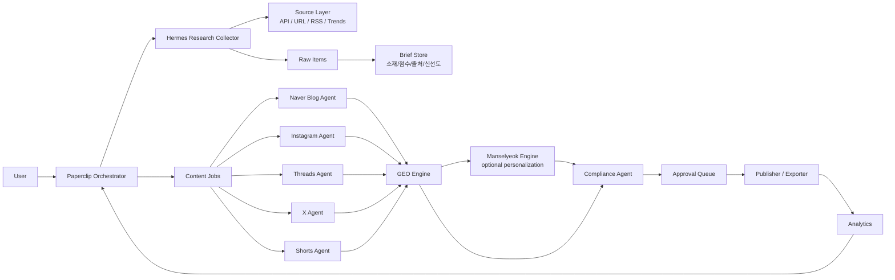
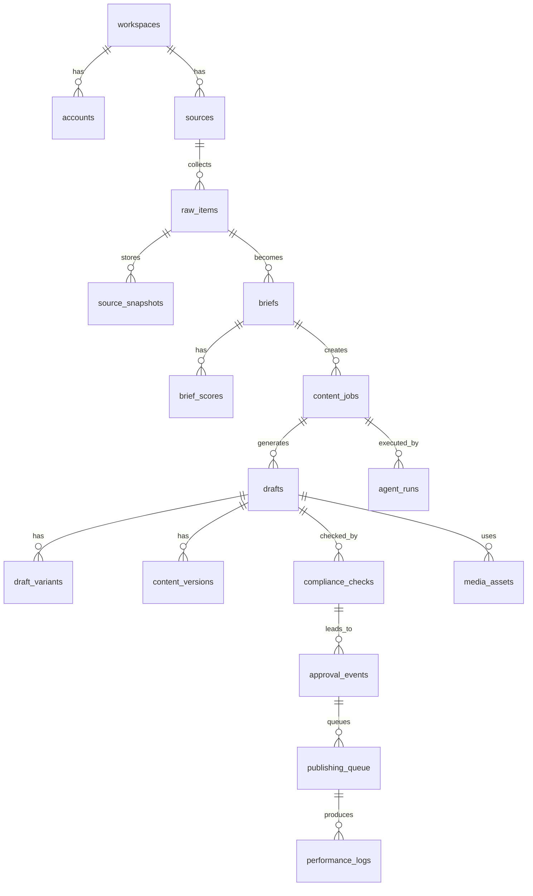

# Paperclip Studio 개발기획서 v0.1

> **문서 상태**: v2 비전 문서 (2026-07-04 결정 — 현행 빌드 정본은 Paperclip Company OS v0.7 `docs/planning/01~07`)
> **채택 범위**: v0.7에 전방 호환 3종만 선반영 — ① workspaces 테이블 + company_profile 연결 (council §4-3 종결),
> ② Export의 PublisherAdapter 인터페이스 격리, ③ 어휘 매핑([vocabulary-map.md](vocabulary-map.md))
> **리뷰**: [studio-v0.1-review.md](studio-v0.1-review.md) — 내부 결함 7건 + v0.7 충돌 8건. v2 재기획 시 이 리뷰부터 해소할 것.
> 원문은 사용자 작성본 그대로 보존 (아래).

---

기준일: 2026년 7월 1일

## 1. 프로젝트 개요

**Paperclip Studio**는 상품, 뉴스, 트렌드, 키워드, 계절성 데이터를 수집하고 이를 콘텐츠 브리프로 가공한 뒤, 네이버 블로그·인스타그램·스레드·X 등 채널별 AI 에이전트가 초안을 생성하고, GEO/SEO 최적화와 컴플라이언스 검수를 거쳐 사용자가 승인 후 발행하거나 내보낼 수 있게 하는 **AI 콘텐츠 운영 OS**다.

이 제품은 단순한 "AI 글쓰기 도구"가 아니라, 콘텐츠 운영자가 매일 반복하는 업무인 **소재 탐색, 주제 선정, 채널별 변환, 검수, 승인, 발행, 성과 기록, 재활용**을 하나의 시스템 안에서 관리하는 것을 목표로 한다.

핵심 컨셉은 다음과 같다.

> **Hermes가 찾고, Paperclip이 판단하고, 채널별 Agent가 만들고, Compliance가 막고, 사용자가 승인하고, Analytics가 다음 결정을 개선한다.**

---

## 2. 제품 목표

Paperclip Studio의 1차 목표는 사용자가 매일 콘텐츠 소재를 찾고, 여러 채널에 맞게 글을 다시 쓰고, 광고/제휴/출처 표시를 확인하는 반복 업무를 줄이는 것이다.

최종적으로는 다음 역할을 수행한다.

| 목표 | 설명 |
| -------------- | ----------------------------------- |
| 소재 자동 수집 | 쇼핑, 뉴스, RSS, URL, 키워드, 트렌드 기반 소재 수집 |
| 브리프 자동 생성 | 원본 데이터를 콘텐츠화 가능한 기획안으로 변환 |
| 채널별 초안 생성 | 네이버 블로그, 인스타그램, 스레드, X 등 채널별 최적화 |
| GEO/SEO/AEO 대응 | 검색형 문단, FAQ, 정의문, 비교표, 요약 구조 생성 |
| 컴플라이언스 검수 | 대가성 표시, 출처, 가격 기준일, 과장 표현, 위험 문구 체크 |
| 승인 기반 운영 | 완전 자동 발행이 아니라 승인 후 발행/내보내기 |
| 성과 학습 | 조회수, 클릭, 저장, 전환 데이터를 다음 주제 선정에 반영 |
| SaaS 확장 | 사용자/브랜드/워크스페이스 단위 운영 가능 구조 |

---

## 3. 핵심 제품 정체성

Paperclip Studio는 **AI 콘텐츠 편집국**처럼 작동한다.

각 구성요소의 정체성은 다음과 같다.

| 구성요소 | 정체성 |
| --------------------- | --------------------- |
| **Paperclip** | 전체 운영 관리자이자 오케스트레이터 |
| **Hermes** | 소재 수집 리서처 |
| **NaverBlogAgent** | 검색형 긴 글 작성자 |
| **InstagramAgent** | 카드뉴스/릴스/캡션 기획자 |
| **ThreadsAgent** | 대화형 짧은 글 작성자 |
| **XAgent** | 짧고 강한 확산형 카피라이터 |
| **GEO Engine** | SEO/AEO/GEO 구조화 엔진 |
| **Manselyeok Engine** | 만세력/오행 기반 개인화 콘텐츠 엔진 |
| **Compliance Agent** | 법적·광고성·출처·가격 리스크 검수자 |
| **Publisher** | 내보내기/예약/일부 API 발행 보조자 |
| **Analytics Agent** | 성과 분석 및 다음 루프 개선 담당자 |

---

## 4. 전체 시스템 구조



---

## 5. 핵심 사용자 시나리오

사용자는 매일 대시보드에 들어와 Paperclip이 추천한 콘텐츠 후보를 확인한다. Hermes는 이미 새벽 또는 오전에 상품, 키워드, 뉴스, 계절성 이슈를 수집해 브리프를 만들어 둔다. Paperclip은 브리프 점수와 채널 적합도를 판단해 "오늘 네이버 블로그 2개, 인스타 캐러셀 3개, 스레드 5개, X 포스트 5개" 같은 작업을 생성한다.

각 채널별 AI 에이전트는 같은 브리프를 받아도 서로 다른 형태로 결과물을 만든다. 네이버 블로그 에이전트는 검색형 긴 글을 만들고, 인스타그램 에이전트는 캐러셀 문구와 캡션을 만들고, 스레드 에이전트는 대화형 짧은 글을 만들고, X 에이전트는 단문 포스트와 스레드를 만든다.

이후 GEO Engine이 FAQ, 정의문, 비교표, 검색형 문단을 보강하고, Compliance Agent가 광고 표시, 출처, 가격 기준일, 과장 표현, 위험 문구를 점검한다. 검수를 통과한 콘텐츠만 승인 대기열로 이동한다. 사용자는 승인, 수정 요청, 폐기 중 하나를 선택한다.

승인된 콘텐츠는 네이버 블로그의 경우 복사/Markdown/HTML 내보내기 중심으로 처리하고, Instagram·Threads·X는 권한과 API 조건이 충족된 경우 Publisher Adapter를 통해 발행 또는 예약 발행 구조로 확장한다.

---

## 6. 플랫폼별 운영 정책

### 6.1 네이버 블로그

네이버 블로그는 **AI 에이전트 배치는 가능하지만, 자동 발행은 MVP에서 제외**한다. 네이버 개발자센터는 외부 서비스에서 네이버 블로그에 글을 등록할 수 있게 하던 로그인 방식 블로그 오픈 API, 즉 글쓰기 API를 2020년 5월 6일 종료한다고 공지했다. 따라서 네이버 블로그 담당 에이전트는 글을 작성하고, 사용자가 복사하거나 HTML/Markdown으로 내보내는 방식이 적합하다. ([NAVER Developers][1])

다만 네이버 블로그 검색 API와 쇼핑 검색 API는 수집/리서치 용도로 사용할 수 있다. 네이버 블로그 검색 API는 블로그 검색 결과를 XML 또는 JSON으로 반환하고, 검색 API의 하루 호출 한도는 25,000회로 문서화되어 있다. ([NAVER Developers][2]) 네이버 쇼핑 검색 API도 쇼핑 검색 결과를 XML 또는 JSON으로 반환하고, 하루 호출 한도 25,000회를 가진다. ([NAVER Developers][3])

따라서 네이버 관련 설계는 다음과 같이 잡는다.

| 기능 | MVP 지원 방식 |
| ------------------ | --------- |
| 네이버 블로그 글 생성 | 지원 |
| 네이버 블로그 자동 발행 | 제외 |
| 네이버 블로그 복사용 본문 | 지원 |
| Markdown/HTML 내보내기 | 지원 |
| 네이버 쇼핑 검색 수집 | 지원 |
| 네이버 블로그 검색 수집 | 지원 |
| 가격/상품명 스냅샷 저장 | 지원 |

---

### 6.2 Instagram

InstagramAgent는 인스타그램용 카드뉴스, 릴스 대본, 캡션, 해시태그, 이미지 프롬프트를 생성한다. Meta의 Instagram Content Publishing 문서는 단일 이미지, 비디오, 릴스, 캐러셀 게시물 발행을 다룬다. ([Facebook Developers][4])

MVP에서는 먼저 **캡션/캐러셀 문구/릴스 대본 Export**를 제공하고, 이후 Meta 앱 권한, 비즈니스 계정, 토큰 관리, 미디어 컨테이너 생성 및 게시 프로세스를 붙이는 방식으로 확장한다.

| 기능 | MVP | 확장 |
| -------- | ------: | -------------: |
| 캡션 생성 | 지원 | 지원 |
| 해시태그 생성 | 지원 | 지원 |
| 캐러셀 문구 | 지원 | 지원 |
| 릴스 대본 | 지원 | 지원 |
| 이미지 프롬프트 | 지원 | 지원 |
| API 발행 | 선택적 제외 | 지원 가능 |
| 예약 발행 | 내부 큐 저장 | API/외부 스케줄러 연동 |

---

### 6.3 Threads

ThreadsAgent는 짧고 대화형인 포스트를 생성한다. Threads API는 이미지, 비디오, 텍스트, 캐러셀 게시물 발행을 지원한다고 공식 문서에 설명되어 있다. ([Facebook Developers][5])

MVP에서는 스레드 초안 생성과 복사 기능을 먼저 제공하고, 이후 API 발행 어댑터를 붙인다.

| 기능 | MVP | 확장 |
| --------- | -----: | ------------: |
| 단문 포스트 생성 | 지원 | 지원 |
| 연속 포스트 생성 | 지원 | 지원 |
| 질문형 마무리 | 지원 | 지원 |
| 링크 포함 문구 | 지원 | 지원 |
| API 발행 | 선택적 제외 | 지원 가능 |
| 성과 수집 | 수동 입력 | API/크롤링/분석 연동 |

---

### 6.4 X

XAgent는 짧고 강한 문장, 단문 포스트, X 스레드, 링크 클릭 유도 문구를 만든다. X API v2는 인증된 사용자를 대신해 새 Post를 생성하거나 기존 Post를 수정하는 Create/Edit Post 엔드포인트를 제공하며, `paid_partnership` 및 `made_with_ai` 같은 필드도 문서화되어 있다. ([X Developer Platform][6])

MVP에서는 X용 문안 생성과 복사/CSV 내보내기를 먼저 제공하고, API 발행은 권한·요금제·토큰 정책 확인 후 붙인다.

| 기능 | MVP | 확장 |
| ----------- | -----: | -----------: |
| 단문 포스트 | 지원 | 지원 |
| X 스레드 | 지원 | 지원 |
| A/B 훅 생성 | 지원 | 지원 |
| 링크 문구 | 지원 | 지원 |
| API 발행 | 선택적 제외 | 지원 가능 |
| 유료 제휴 표시 필드 | 내부 검수 | API 필드 연동 가능 |

---

## 7. AI 에이전트 설계

AI 에이전트는 단순히 프롬프트 하나로 구성하지 않는다. 각 에이전트는 다음 구성요소를 가진다.

```text
Agent
├─ role
├─ objective
├─ input_schema
├─ output_schema
├─ prompt_template
├─ channel_rules
├─ compliance_rules
├─ tools/functions
├─ retry_policy
└─ evaluation_criteria
```

OpenAI API 기준으로는 Responses API를 중심으로 설계하는 것이 적합하다. OpenAI 공식 문서는 Responses API를 agent-like application을 만들기 위한 통합 인터페이스로 설명하고, web search, file search, computer use, code interpreter, remote MCP, custom functions 같은 도구 호출을 포함할 수 있다고 설명한다. ([OpenAI 개발자][7]) 또한 function calling은 모델이 도구 호출을 반환하고, 애플리케이션이 해당 함수를 실행한 뒤 결과를 다시 모델에 전달하는 다단계 흐름으로 설명된다. ([OpenAI 개발자][8])

---

## 8. 에이전트별 상세 역할

### 8.1 Paperclip Orchestrator

Paperclip은 전체 운영 관리자다. 직접 글을 쓰기보다는 작업을 만들고, 어떤 에이전트를 실행할지 결정하고, 상태를 관리한다.

주요 역할은 다음과 같다.

| 기능 | 설명 |
| ------------ | ---------------------------- |
| 오늘의 목표 설정 | 워크스페이스/계정별 콘텐츠 목표 확인 |
| Hermes 실행 지시 | 수집 소스별 작업 생성 |
| 브리프 점수화 | 트렌드, 상업성, 계절성, 채널 적합도 계산 |
| 에이전트 선택 | 브리프별로 필요한 채널 에이전트 선정 |
| 작업 상태 관리 | 수집 → 초안 → 검수 → 승인 → 발행 상태 관리 |
| 실패 처리 | API 실패, 크롤링 실패, 생성 실패 재시도 |
| 승인 요청 | 사람이 확인해야 하는 콘텐츠를 대기열로 보냄 |
| 성과 반영 | 조회수/클릭/저장/전환 데이터를 다음 추천에 반영 |

Paperclip은 다음과 같은 판단을 한다.

```json
{
  "brief_id": "brief_001",
  "topic": "장마철 자취방 습기 제거템",
  "selected_agents": [
    "NaverBlogAgent",
    "InstagramAgent",
    "ThreadsAgent"
  ],
  "skipped_agents": [
    {
      "agent": "XAgent",
      "reason": "해당 소재는 정보형/저장형 콘텐츠 적합도가 더 높음"
    }
  ],
  "priority": "high",
  "requires_human_review": true
}
```

---

### 8.2 Hermes Research Collector

Hermes는 소재 수집 담당이다. Hermes의 목적은 글을 쓰는 것이 아니라, 원본 정보를 수집하고 콘텐츠 브리프로 바꾸는 것이다.

수집 대상은 다음과 같다.

| 수집 대상 | 방식 |
| ---------- | --------------------------- |
| 네이버 쇼핑 | 공식 검색 API |
| 네이버 블로그 검색 | 공식 검색 API |
| 쿠팡 | 파트너스/제휴 링크/공식 가능 범위 확인 후 연동 |
| 무신사/올리브영 | URL 입력 기반 공개 페이지 분석 우선 |
| 뉴스/AI Tech | RSS, 공식 블로그, 뉴스 URL |
| 트렌드 키워드 | 검색 키워드, 날짜, 시즌성 |
| 기존 성과 | 클릭, 조회, 저장, 전환 데이터 |
| 수동 입력 | 사용자가 URL/키워드 직접 입력 |

쿠팡의 경우 공식 쿠팡 파트너스 사이트는 쿠팡 상품을 콘텐츠에 연결할 수 있는 어필리에이트 프로그램을 제공한다고 설명한다. ([Coupang Partners][9]) 다만 실제 API 사용 범위, 링크 생성 방식, 약관은 계정 권한에 따라 달라질 수 있으므로 MVP에서는 "URL 입력 + 수동 제휴 링크 저장 + 추후 API 연결" 순서로 구현한다.

Hermes의 출력은 다음과 같은 브리프여야 한다.

```json
{
  "topic": "장마철 자취방 습기 제거템",
  "source_type": "shopping_trend",
  "angle": "장마철 냄새와 습기를 줄이는 실용템 비교",
  "season_tags": ["장마", "여름", "자취"],
  "recommended_channels": ["naver_blog", "instagram", "threads"],

  "score": {
    "commercial_score": 87,
    "trend_score": 74,
    "seasonality_score": 92,
    "competition_score": 48,
    "channel_fit_score": 81,
    "final_score": 84
  },

  "sources": [
    {
      "source_name": "naver_shopping_api",
      "source_ref": "api_item_id_or_url",
      "fetched_at": "2026-07-01T08:00:00+09:00"
    }
  ],

  "products": [
    {
      "name": "예시 제습제",
      "price": 12900,
      "price_checked_at": "2026-07-01T08:00:00+09:00",
      "affiliate_available": true
    }
  ],

  "compliance_flags": {
    "requires_affiliate_disclosure": true,
    "requires_price_disclaimer": true,
    "medical_or_safety_claim": false
  },

  "freshness_expires_at": "2026-07-04T08:00:00+09:00",
  "status": "brief_created"
}
```

---

### 8.3 NaverBlogAgent

NaverBlogAgent는 네이버 블로그용 긴 글을 작성한다.

주요 출력물은 다음과 같다.

| 출력물 | 설명 |
| ------ | ----------------------- |
| 검색형 제목 | 키워드가 자연스럽게 포함된 제목 |
| 도입문 | 검색 유저의 문제를 짚는 문단 |
| 목차 | H2/H3 구조 |
| 본문 | 설명형/비교형/추천형 글 |
| 비교표 | 상품, 가격, 장점, 단점, 추천 대상 |
| FAQ | 검색/AI 답변에 적합한 질문 답변 |
| 출처 문단 | 수집 출처와 확인일 |
| 가격 기준일 | 가격 변동 가능성 표시 |
| 제휴 표시 | 제휴 링크 포함 시 표시 |
| Export | Markdown, HTML, 복사용 텍스트 |

출력 예시는 다음과 같다.

```json
{
  "channel": "naver_blog",
  "title": "장마철 자취방 습기 제거템 추천: 제습제부터 미니 제습기까지 비교",
  "format": "long_form_blog",
  "sections": [
    {
      "heading": "장마철 자취방 습기가 심해지는 이유",
      "body": "..."
    },
    {
      "heading": "추천 제품 비교표",
      "body": "..."
    }
  ],
  "faq": [
    {
      "question": "자취방에는 제습제와 제습기 중 무엇이 더 좋나요?",
      "answer": "..."
    }
  ],
  "disclosure": "이 글은 제휴 링크를 포함할 수 있으며, 구매 시 일정 수수료가 발생할 수 있습니다.",
  "price_notice": "가격은 2026년 7월 1일 확인 기준이며 변동될 수 있습니다.",
  "export_formats": ["markdown", "html", "copy_block"]
}
```

---

### 8.4 InstagramAgent

InstagramAgent는 인스타그램용 시각 콘텐츠를 기획한다.

주요 출력물은 다음과 같다.

| 출력물 | 설명 |
| -------- | ------------------------- |
| 캐러셀 구성 | 1장 후킹, 2~6장 정보, 마지막 저장 유도 |
| 캡션 | 감성적이고 짧은 설명 |
| 해시태그 | 대형/중형/소형 해시태그 조합 |
| 릴스 대본 | 15초/30초/60초 영상 대본 |
| 썸네일 문구 | 첫 화면에서 잡아끄는 문장 |
| 이미지 프롬프트 | 카드뉴스/썸네일 생성용 지시문 |
| CTA | 저장, 공유, 댓글 유도 |

출력 예시는 다음과 같다.

```json
{
  "channel": "instagram",
  "format": "carousel",
  "slides": [
    {
      "slide": 1,
      "text": "장마철 자취방 냄새, 사실 습기 때문일 수 있어요"
    },
    {
      "slide": 2,
      "text": "1. 옷장에는 걸이형 제습제"
    },
    {
      "slide": 3,
      "text": "2. 침대 밑에는 대용량 제습제"
    }
  ],
  "caption": "장마철만 되면 방이 꿉꿉하다면 먼저 습기부터 잡아야 해요.",
  "hashtags": ["#장마템", "#자취방꿀템", "#습기제거", "#생활꿀팁"],
  "cta": "저장해두고 장마 시작 전에 체크해보세요."
}
```

---

### 8.5 ThreadsAgent

ThreadsAgent는 스레드용 짧고 대화형인 글을 만든다.

주요 출력물은 다음과 같다.

| 출력물 | 설명 |
| ------- | ---------------- |
| 훅 문장 | 첫 문장에서 공감 유도 |
| 단문 포스트 | 짧고 자연스러운 문장 |
| 연속 포스트 | 3~5개로 나눈 스레드 |
| 질문형 마무리 | 댓글 유도 |
| 블로그 재활용 | 긴 글을 대화형 포스트로 변환 |

출력 예시는 다음과 같다.

```json
{
  "channel": "threads",
  "posts": [
    "장마철에 자취방 냄새가 심해지는 건 청소 문제보다 습기 문제일 때가 많다.",
    "특히 옷장, 침대 밑, 신발장처럼 공기가 안 도는 곳은 제습제를 따로 둬야 체감이 큼.",
    "방 전체용 1개보다 작은 제습템을 여러 구역에 나누는 방식이 더 실용적이라고 봄.",
    "장마 전에 미리 준비하는 편이야, 아니면 꿉꿉해지고 나서 사는 편이야?"
  ]
}
```

---

### 8.6 XAgent

XAgent는 짧고 강한 확산형 문장을 만든다.

주요 출력물은 다음과 같다.

| 출력물 | 설명 |
| -------- | -------------- |
| 단문 포스트 | 핵심 메시지 1개 |
| X 스레드 | 짧은 연속 글 |
| A/B 훅 | 여러 개의 첫 문장 후보 |
| 링크 클릭 문구 | 외부 링크 유도 |
| 이슈 반응 문구 | 트렌드 기반 반응형 포스트 |

출력 예시는 다음과 같다.

```json
{
  "channel": "x",
  "variants": [
    {
      "type": "single_post",
      "text": "장마철 자취방 냄새는 방향제보다 제습이 먼저입니다. 옷장, 침대 밑, 신발장만 잡아도 체감이 꽤 달라져요."
    },
    {
      "type": "thread",
      "posts": [
        "장마철 자취방 습기 줄이는 법.",
        "1. 옷장: 걸이형 제습제",
        "2. 침대 밑: 대용량 제습제",
        "3. 신발장: 탈취+제습 겸용",
        "방향제는 마지막입니다. 먼저 습기부터 잡아야 해요."
      ]
    }
  ]
}
```

---

### 8.7 GEO Engine

GEO Engine은 콘텐츠를 검색엔진과 AI 답변 환경에 적합하게 구조화한다.

주요 기능은 다음과 같다.

| 기능 | 설명 |
| -------- | ------------------- |
| 정의문 생성 | "OO란 무엇인가?"에 답하는 문단 |
| FAQ 생성 | 검색 질의형 질문과 답변 |
| 비교표 생성 | 상품/서비스/방법 비교 |
| 요약 박스 | 핵심 요약 3~5줄 |
| 검색형 제목 | 사용자가 검색할 만한 제목 |
| AEO 문단 | 답변엔진이 인용하기 쉬운 구조 |
| 내부 링크 제안 | 관련 글/관련 주제 연결 |
| 키워드 클러스터 | 메인/서브/롱테일 키워드 분리 |

---

### 8.8 Manselyeok Engine

Manselyeok Engine은 만세력, 오행, 사주 기반 개인화 콘텐츠를 만든다.

단, 이 엔진은 반드시 주의해서 다뤄야 한다. 운세나 성향 콘텐츠는 재미와 자기이해 관점으로 제공해야 하며, 건강·투자·결혼·법률·중대한 의사결정을 단정적으로 유도하면 안 된다.

주요 기능은 다음과 같다.

| 기능 | 설명 |
| ----------- | ----------------------------------- |
| 생년월일시 기반 분석 | 사용자가 제공한 정보 기반 |
| 오행 밸런스 | 목화토금수 비율 설명 |
| 계절성 콘텐츠 연결 | 특정 달/절기/시즌 콘텐츠 생성 |
| 개인화 문장 | 사용자 성향별 콘텐츠 추천 |
| 금지 표현 체크 | "반드시", "무조건", "이 사람은 실패한다" 같은 단정 방지 |
| 고지 문구 | 참고/엔터테인먼트 성격 명시 |

예시 출력은 다음과 같다.

```json
{
  "engine": "manselyeok",
  "content_type": "personalized_intro",
  "tone": "soft",
  "result": "이번 달은 정리와 루틴을 다시 잡기 좋은 흐름으로 해석할 수 있습니다.",
  "disclaimer": "이 내용은 자기이해와 콘텐츠 참고용이며, 중요한 의사결정의 근거로 사용해서는 안 됩니다."
}
```

---

### 8.9 Compliance Agent

Compliance Agent는 광고성, 출처, 가격, 과장 표현, 위험 문구를 점검한다.

공정거래위원회 관련 안내와 심사지침에서는 추천·보증에서 경제적 이해관계를 표시해야 하며, 표시문구는 소비자가 쉽게 찾을 수 있도록 추천·보증 내용과 근접한 위치에 표시해야 한다고 설명한다. ([법제처][10]) 2026년 공정위 행정예고에는 AI를 활용해 실제 인물인지 구분하기 어려운 가상 전문가를 생성해 광고하는 사례와 관련하여, AI 기반 가상인물 표시 규정 신설 취지가 설명되어 있다. ([국민참여입법센터][11])

Compliance Agent의 체크 항목은 다음과 같다.

| 체크 항목 | 설명 |
| -------- | -------------------------------- |
| 제휴/광고 표시 | 쿠팡, 쇼핑커넥트, 협찬, 수수료 발생 가능성 |
| 표시 위치 | 제목 또는 본문 첫 부분 등 잘 보이는 위치 |
| 가격 기준일 | 가격/재고 변동 가능성 표시 |
| 출처 표시 | API, URL, 공식 페이지, 뉴스 출처 |
| 과장 표현 | "100%", "무조건", "완벽", "반드시" 등 |
| 후기 위장 | 실제 사용하지 않은 제품을 사용 후기처럼 표현하는 것 방지 |
| 건강/금융/법률 | 전문 조언처럼 보이는 문구 제한 |
| 만세력/운세 | 단정·공포 유발·의사결정 유도 금지 |
| AI 생성 인물 | 가상 전문가/가상 인물 사용 시 명확 표시 |
| 플랫폼 정책 | 각 채널별 금지 표현/제한 확인 |

Compliance Agent 출력 예시는 다음과 같다.

```json
{
  "risk_level": "medium",
  "pass": false,
  "issues": [
    {
      "type": "affiliate_disclosure_missing",
      "severity": "high",
      "message": "제휴 링크가 포함되어 있으나 경제적 이해관계 표시가 없습니다.",
      "suggested_fix": "본문 첫 부분에 '이 글은 제휴 링크를 포함하고 있으며, 구매 시 수수료를 받을 수 있습니다.' 문구를 추가하세요."
    },
    {
      "type": "price_freshness_missing",
      "severity": "medium",
      "message": "상품 가격 기준일이 없습니다.",
      "suggested_fix": "가격은 2026년 7월 1일 확인 기준이며 변동될 수 있습니다."
    }
  ]
}
```

---

## 9. 콘텐츠 상태값 설계

콘텐츠는 아래 상태를 따라 이동한다.

```text
collected
→ normalized
→ deduplicated
→ brief_created
→ scored
→ draft_requested
→ draft_generated
→ geo_optimized
→ compliance_checked
→ needs_human_review
→ revision_requested
→ approved
→ scheduled
→ published
→ performance_collected
→ recycled
```

예외 상태는 다음과 같다.

```text
duplicate
stale
failed
rejected
archived
needs_source_refresh
compliance_failed
publish_failed
```

상태값이 중요한 이유는 자동화가 커질수록 작업이 꼬이는 것을 막기 위해서다. 특히 상품 가격, 재고, 할인, 트렌드 기반 콘텐츠는 시간이 지나면 `stale` 또는 `needs_source_refresh` 상태로 전환되어야 한다.

---

## 10. 핵심 데이터베이스 설계

### 10.1 기본 테이블

| 테이블 | 역할 |
| ------------------- | ------------------------------- |
| `workspaces` | 사용자/브랜드 단위 작업공간 |
| `workspace_members` | 팀원, 권한, 역할 |
| `accounts` | 네이버, 인스타그램, 스레드, X 등 채널 계정 |
| `sources` | API, RSS, URL, 키워드 등 수집 소스 |
| `raw_items` | Hermes가 수집한 원본 데이터 |
| `source_snapshots` | 수집 당시의 상품명, 가격, URL, 이미지, 본문 보존 |
| `briefs` | 콘텐츠화 가능한 소재 브리프 |
| `brief_scores` | 점수 산식과 점수 결과 |
| `products` | 상품명, 가격, 이미지, 카테고리 |
| `affiliate_links` | 쿠팡, 쇼핑커넥트, 무신사, 올영 등 제휴 링크 |
| `content_jobs` | Paperclip이 생성한 작업 |
| `drafts` | 채널별 초안 |
| `draft_variants` | A/B 버전, 다른 훅, 다른 톤의 초안 |
| `content_versions` | 초안 수정 이력 |
| `compliance_checks` | 검수 결과 |
| `approval_events` | 승인, 반려, 수정 요청 이력 |
| `publishing_queue` | 발행/내보내기 대기열 |
| `performance_logs` | 조회수, 클릭, 저장, 전환 기록 |
| `link_events` | 클릭 추적 이벤트 |
| `agent_runs` | Hermes, Paperclip, Writer 실행 로그 |
| `prompt_templates` | 프롬프트 템플릿과 버전 |
| `agent_configs` | 에이전트별 설정 |
| `api_credentials` | 암호화된 외부 API 토큰 |
| `media_assets` | 이미지, 썸네일, 영상, 자막 파일 |
| `cost_logs` | AI 호출 비용, API 비용, 크롤링 비용 |
| `error_logs` | 실패 로그 |
| `dead_letter_jobs` | 재처리 대상 실패 작업 |

---

### 10.2 핵심 엔티티 관계



---

## 11. 주요 API 설계

### 11.1 Brief 관련 API

```http
POST /api/briefs
GET /api/briefs
GET /api/briefs/:id
PATCH /api/briefs/:id
POST /api/briefs/:id/score
POST /api/briefs/:id/refresh-sources
```

### 11.2 Hermes 관련 API

```http
POST /api/hermes/collect
POST /api/hermes/collect/url
POST /api/hermes/collect/keyword
POST /api/hermes/collect/naver-shopping
POST /api/hermes/collect/rss
GET /api/hermes/runs
GET /api/hermes/runs/:id
```

### 11.3 Paperclip 관련 API

```http
POST /api/paperclip/daily-plan
POST /api/paperclip/create-jobs
POST /api/paperclip/dispatch
GET /api/paperclip/today
GET /api/paperclip/status
```

### 11.4 Agent 실행 API

```http
POST /api/agents/naver-blog/generate
POST /api/agents/instagram/generate
POST /api/agents/threads/generate
POST /api/agents/x/generate
POST /api/agents/geo/optimize
POST /api/agents/compliance/check
POST /api/agents/manselyeok/generate
```

### 11.5 Approval 관련 API

```http
GET /api/approval-queue
POST /api/approval-queue/:id/approve
POST /api/approval-queue/:id/reject
POST /api/approval-queue/:id/request-revision
```

### 11.6 Publisher 관련 API

```http
POST /api/publisher/export/markdown
POST /api/publisher/export/html
POST /api/publisher/export/csv
POST /api/publisher/copy-block
POST /api/publisher/instagram/publish
POST /api/publisher/threads/publish
POST /api/publisher/x/publish
```

### 11.7 Analytics 관련 API

```http
POST /api/analytics/manual
POST /api/analytics/click
GET /api/analytics/content/:id
GET /api/analytics/channel/:channel
GET /api/analytics/workspace/summary
```

---

## 12. 기술 스택

| 영역 | 추천 |
| ------------- | --------------------------------------- |
| Frontend | Next.js |
| Backend | Next.js API Routes 또는 NestJS |
| DB | PostgreSQL |
| ORM | Prisma 또는 Drizzle |
| Queue | BullMQ + Redis |
| Scheduler | BullMQ Job Schedulers |
| Storage | S3 호환 스토리지 |
| Auth | Auth.js 또는 Clerk |
| AI | OpenAI Responses API + function calling |
| Search/Vector | PostgreSQL pgvector 또는 별도 Vector DB |
| Crawler | API 우선, 필요 시 Playwright |
| Deployment | Vercel + Supabase/Railway/Fly.io |
| Monitoring | Sentry, OpenTelemetry, Logtail 등 |
| Analytics | 자체 이벤트 로그 + 외부 GA/UTM 연동 |

BullMQ는 v5.16.0 이후 Job Schedulers가 repeatable jobs를 대체한다고 공식 문서에 설명되어 있으므로, 스케줄링 설계는 `repeatable jobs`가 아니라 `Job Schedulers` 기준으로 잡는 것이 좋다. ([BullMQ][12])

---

## 13. Queue 및 Scheduler 설계

Paperclip Studio는 긴 작업이 많기 때문에 동기 처리보다 Queue 기반 처리가 필요하다.

주요 큐는 다음과 같다.

| Queue | 역할 |
| ------------------- | ----------- |
| `hermes.collect` | 소재 수집 |
| `hermes.normalize` | 원본 정규화 |
| `brief.score` | 브리프 점수화 |
| `content.generate` | 채널별 초안 생성 |
| `geo.optimize` | GEO/SEO 최적화 |
| `compliance.check` | 검수 |
| `publisher.export` | 내보내기 |
| `publisher.publish` | API 발행 |
| `analytics.collect` | 성과 수집 |
| `source.refresh` | 가격/출처 새로고침 |
| `dead_letter` | 실패 작업 보관 |

매일 오전 실행 루프는 다음과 같다.

```text
1. Paperclip이 워크스페이스별 오늘 목표 확인
2. Hermes 수집 작업 생성
3. raw_items 저장
4. 중복 제거 및 source_snapshot 저장
5. briefs 생성
6. brief_scores 계산
7. 상위 브리프 선별
8. channel_fit 기준으로 Agent 선택
9. 채널별 content_jobs 생성
10. drafts 생성
11. GEO 최적화
12. Compliance 검수
13. Approval Queue 이동
14. 사용자 승인
15. Export 또는 Publish
16. 성과 수집
17. 다음 추천 점수에 반영
```

---

## 14. 점수화 모델

Paperclip은 브리프를 다음 기준으로 점수화한다.

| 점수 | 설명 |
| ----------------------- | ------------- |
| `commercial_score` | 상품/제휴/전환 가능성 |
| `trend_score` | 현재 트렌드와의 관련성 |
| `seasonality_score` | 계절/날짜/이벤트 적합도 |
| `competition_score` | 경쟁 콘텐츠 과밀도 |
| `source_quality_score` | 출처 신뢰도 |
| `freshness_score` | 정보 최신성 |
| `channel_fit_score` | 채널별 적합도 |
| `compliance_risk_score` | 광고/법적/표현 리스크 |
| `final_score` | 최종 콘텐츠화 우선순위 |

예시 산식은 다음과 같다.

```text
final_score =
commercial_score * 0.25
+ trend_score * 0.20
+ seasonality_score * 0.15
+ source_quality_score * 0.15
+ channel_fit_score * 0.15
+ freshness_score * 0.10
- compliance_risk_score * 0.20
```

---

## 15. MVP 범위

1차 MVP는 완전 자동 발행기가 아니라 **승인 기반 AI 콘텐츠 운영 대시보드**로 만든다.

### MVP 포함 기능

| 단계 | 기능 |
| -: | -------------------------------- |
| 1 | URL/키워드 기반 Hermes 수집 |
| 2 | 네이버 쇼핑 검색 API 기반 상품 수집 |
| 3 | RSS/공식 블로그/뉴스 URL 수집 |
| 4 | raw item 저장 및 source snapshot 저장 |
| 5 | 브리프 생성 및 점수화 |
| 6 | Paperclip 작업 생성 |
| 7 | NaverBlogAgent 초안 생성 |
| 8 | InstagramAgent 캡션/캐러셀/릴스 대본 생성 |
| 9 | ThreadsAgent 짧은 글 생성 |
| 10 | XAgent 단문/스레드 생성 |
| 11 | GEO Engine FAQ/비교표/정의문 생성 |
| 12 | Compliance Agent 검수 |
| 13 | 승인 대기열 |
| 14 | Markdown/HTML/CSV/복사용 텍스트 Export |
| 15 | 클릭 추적 링크 생성 |
| 16 | 성과 수동 입력 |
| 17 | 성과 기반 간단한 추천 개선 |

### MVP 제외 기능

| 기능 | 제외 이유 |
| ---------------- | ------------------- |
| 네이버 블로그 자동 발행 | 글쓰기 API 종료 및 정책 리스크 |
| 모든 쇼핑몰 자동 크롤링 | 약관/차단/법적 리스크 |
| 완전 자동 발행 | 초기에는 사람 승인 데이터가 필요 |
| Shorts 영상 자동 생성 | 비용과 품질 관리 난도 높음 |
| 자동 구매/재고 추적 | 커머스 시스템 복잡도 증가 |
| 완전 개인화 만세력 대량 발행 | 표현 리스크와 민감도 높음 |

---

## 16. 대시보드 화면 설계

### 16.1 메인 대시보드

메인 대시보드는 네 영역이면 충분하다.

| 영역 | 내용 |
| ---------- | ----------------------- |
| 오늘의 작업 | Paperclip이 추천한 콘텐츠 후보 |
| Hermes 수집함 | 새로 들어온 상품, 뉴스, 키워드, URL |
| 초안 보드 | 채널별 생성된 초안 |
| 승인 대기열 | 검수 통과 후 발행 전 콘텐츠 |

### 16.2 Hermes 수집함

표시 항목은 다음과 같다.

```text
- topic
- source_type
- source_name
- fetched_at
- trend_score
- commercial_score
- seasonality_score
- freshness_expires_at
- status
```

### 16.3 브리프 상세 화면

브리프 상세 화면에는 다음이 필요하다.

```text
- 주제
- 추천 각도
- 추천 채널
- 점수 상세
- 원본 출처
- 상품 목록
- 가격 확인일
- 제휴 가능 여부
- 컴플라이언스 플래그
- 콘텐츠 작업 생성 버튼
```

### 16.4 초안 보드

초안 보드는 Kanban 형태가 좋다.

```text
draft_generated
→ geo_optimized
→ compliance_checked
→ needs_human_review
→ approved
→ scheduled
→ published
```

### 16.5 승인 대기열

승인 대기열에서 사용자는 다음 작업을 한다.

```text
- 미리보기
- 수정 요청
- 직접 수정
- 승인
- 반려
- 내보내기
- 발행 예약
```

---

## 17. 권한 및 워크스페이스 구조

B2B/SaaS 확장을 고려해 처음부터 워크스페이스 구조를 넣는다.

| 권한 | 설명 |
| -------- | -------------------- |
| Owner | 결제, 워크스페이스 삭제, 전체 권한 |
| Admin | 계정 연결, 에이전트 설정, 승인 |
| Editor | 브리프 수정, 초안 수정, 승인 요청 |
| Reviewer | 검수, 승인/반려 |
| Viewer | 읽기 전용 |

---

## 18. 보안 요구사항

중요한 보안 요구사항은 다음과 같다.

```text
- API 키와 Access Token은 반드시 암호화 저장
- workspace_id 기준 데이터 격리
- 승인 전 자동 발행 금지
- Agent 실행 로그 저장
- Prompt와 Output 버전 저장
- 외부 URL 수집 시 SSRF 방어
- 이미지/파일 업로드 시 MIME 검사
- 관리자 작업 audit log 저장
- 결제/제휴/광고 계정 정보 접근 제한
```

---

## 19. 품질 기준

생성된 콘텐츠는 다음 기준을 통과해야 한다.

| 기준 | 설명 |
| ------ | ------------------------- |
| 출처 기반성 | 브리프에 없는 사실을 과도하게 만들지 않을 것 |
| 채널 적합성 | 채널 문법에 맞을 것 |
| 중복 방지 | 같은 문장/구조 반복 최소화 |
| 광고 표시 | 제휴/협찬 여부가 명확할 것 |
| 가격 신선도 | 가격 기준일 포함 |
| 과장 방지 | 효과를 단정하지 않을 것 |
| 수정 가능성 | 사용자가 쉽게 고칠 수 있을 것 |
| 재사용성 | 한 브리프에서 여러 채널로 변환 가능할 것 |

---

## 20. 개발 단계

### Phase 1: Core MVP

```text
- 사용자/워크스페이스/계정 기본 구조
- Hermes URL/키워드 수집
- 네이버 쇼핑 검색 수집
- raw_items, briefs, source_snapshots 저장
- Paperclip 브리프 점수화
- NaverBlogAgent 초안 생성
- Compliance 기본 체크
- 승인 대기열
- Markdown/HTML/복사 Export
```

### Phase 2: Multi-channel Agents

```text
- InstagramAgent
- ThreadsAgent
- XAgent
- GEO Engine 고도화
- draft_variants
- prompt_templates
- channel_rules
- content_versions
```

### Phase 3: Publishing & Analytics

```text
- Instagram Publisher Adapter
- Threads Publisher Adapter
- X Publisher Adapter
- 클릭 추적 링크
- 성과 수동 입력
- performance_logs
- channel별 성과 리포트
```

### Phase 4: Automation & SaaS

```text
- Paperclip 일일 자동 루프
- BullMQ Job Schedulers 기반 반복 작업
- workspace_members 권한 관리
- 비용 추적
- 에이전트 설정 UI
- 성과 기반 추천 개선
```

### Phase 5: Advanced Engines

```text
- Manselyeok Engine 연동
- 개인화 콘텐츠 생성
- Shorts/Reels 대본 고도화
- 이미지 생성 프롬프트 관리
- 브랜드 톤 학습
- B2B 클라이언트별 운영 리포트
```

---

## 21. 주요 리스크와 대응

| 리스크 | 대응 |
| ---------------- | --------------------------------------------- |
| 네이버 블로그 자동 발행 불가 | Export 중심으로 설계 |
| 플랫폼 API 정책 변경 | Publisher Adapter를 분리해 교체 가능하게 설계 |
| 제휴/광고 표시 누락 | Compliance Agent 필수 통과 |
| 가격 변동 | `price_checked_at`, `freshness_expires_at` 저장 |
| AI 환각 | source_snapshot 기반 생성, 출처 없는 사실 제한 |
| 과도한 자동화 | 사람 승인 기반 MVP |
| 크롤링 차단 | API 우선, URL 분석은 제한적으로 |
| 비용 증가 | `cost_logs`와 모델별 사용량 추적 |
| 콘텐츠 중복 | deduplication 및 draft similarity check |
| 법적 표현 리스크 | 위험 카테고리 룰셋과 수동 검수 |

---

## 22. 최종 제품 정의

Paperclip Studio의 최종 정의는 다음과 같다.

> **Paperclip Studio는 상품, 뉴스, 트렌드, 계절성 이슈를 수집해 콘텐츠 브리프로 만들고, 채널별 AI 에이전트가 네이버 블로그·인스타그램·스레드·X용 콘텐츠 초안을 생성하며, GEO 최적화와 컴플라이언스 검수를 거쳐 사용자가 승인 후 발행하거나 내보낼 수 있게 하는 AI 콘텐츠 운영 OS다.**

한 줄 버전은 다음과 같다.

> **Hermes가 소재를 찾고, Paperclip이 판단하고, 채널별 AI 에이전트가 만들고, Compliance가 검수하고, 사용자가 승인하고, Analytics가 다음 결정을 개선한다.**

---

## 23. 1차 개발 우선순위

가장 먼저 만들어야 하는 순서는 이렇다.

```text
1. workspaces / accounts / users 기본 구조
2. sources / raw_items / source_snapshots
3. Hermes URL·키워드·네이버 쇼핑 수집
4. briefs / brief_scores
5. Paperclip content_jobs 생성
6. NaverBlogAgent
7. InstagramAgent
8. ThreadsAgent
9. XAgent
10. GEO Engine
11. Compliance Agent
12. Approval Queue
13. Markdown/HTML/CSV Export
14. performance_logs
15. Paperclip daily loop
```

---

## 24. 최종 판단

이 기획은 충분히 제품화 가능하다.
다만 처음부터 "완전 자동 포스팅 프로그램"으로 만들면 플랫폼 정책, 광고 표시, API 권한, 콘텐츠 품질 문제가 한꺼번에 터질 수 있다.

그래서 1차 제품의 정확한 방향은 다음이어야 한다.

> **"Hermes가 소재를 찾고, Paperclip이 판단하고, 채널별 AI 에이전트가 초안을 만들고, Compliance가 검수하고, 내가 승인해서 발행하거나 내보내는 시스템."**

이 방향이면 기술적으로 현실적이고, 운영 리스크도 낮고, 나중에 B2B/SaaS로 확장하기도 좋다.
다음 단계는 이 기획서를 기준으로 **ERD, API 명세, 화면 와이어프레임, Agent 프롬프트 명세**를 순서대로 뽑으면 된다.

[1]: https://developers.naver.com/notice/article/7527 "블로그 오픈 API 종료 안내 - 공지사항"
[2]: https://developers.naver.com/docs/serviceapi/search/blog/blog.md "검색 > 블로그 - Search API"
[3]: https://developers.naver.com/docs/serviceapi/search/shopping/shopping.md "검색 > 쇼핑 - Search API"
[4]: https://developers.facebook.com/documentation/instagram-platform/content-publishing?utm_source=chatgpt.com "Content Publishing - Meta for Developers - Facebook"
[5]: https://developers.facebook.com/docs/threads/create-posts/?utm_source=chatgpt.com "Create Posts - Threads API - Meta for Developers"
[6]: https://docs.x.com/x-api/posts/create-post "Create or Edit Post - X"
[7]: https://developers.openai.com/api/docs/guides/migrate-to-responses?utm_source=chatgpt.com "Migrate to the Responses API"
[8]: https://developers.openai.com/api/docs/guides/function-calling?utm_source=chatgpt.com "Function calling | OpenAI API"
[9]: https://partners.coupang.com/?utm_source=chatgpt.com "쿠팡 파트너스 공식 사이트 - Coupang Partners"
[10]: https://www.law.go.kr/admRulInfoP.do?admRulSeq=2100000190311&utm_source=chatgpt.com "추천·보증 등에 관한 표시·광고 심사지침"
[11]: https://opinion.lawmaking.go.kr/gcom/admpp/46542?utm_source=chatgpt.com "추천·보증 등에 관한 표시·광고 심사지침 개정안 행정예고"
[12]: https://docs.bullmq.io/guide/job-schedulers "Job Schedulers | BullMQ"
